# Manual técnico

# U-Storage 

## Indice

  - [Objetivos](#objetivos)
  - [Arquitectura](#arquitectura)
  - [Usuarios IAM](#usuarios-iam)
  - [Pasos](#pasos)
  - [Conclusiones](#conclusiones)

## Objetivos
### General
- Cloud permite la innovación a través del acceso a nuevas tecnologías de forma
rápida, segura y fácil.

### Específicos
- Aplicar los conocimientos adquiridos tanto de la clase magistral y el laboratorio.
- Implementar una arquitectura utilizando servicios en la nube.
- Integrar servicios de AWS.
- Aplicar las tecnologías de la nube a un entorno real.

## Arquitectura

## Usuarios IAM
  
  ### Usuarios Administrador
  Administrador_201403632
  Administrador_201603052
  
  ### Usuario para bucket
  s3_user: Usuario para la creación de bucket.
 
 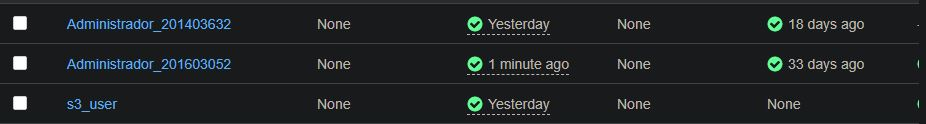  
 
 ## Pasos
  ### Creación de bucket
  Para la creación de un Bucket primero se debe de buscar S3
  
   
 
  luego ir a boton "Crear Bucket" al presionar este boton saldran los siguientes datos que se deben de llenar:
  
  1. Primero se debe de ingresar el nombre de Bucket y región en la cuál se desea crear.
 
   
 
 2. Luego se ingresa si deseamos tener nuestro bucket privado o público, para nuestro caso será publico por lo que desmarcaremos "Block all public access"
 
  
 
 3. Al ingresar los datos anteriores veremos una opción la cuál nos permite tener versionamientos de bucket, para nuestro caso la dejaremos "Disabled", también podremos      agregar Tags.
 
  
  
  4. Encriptacion la dejaremos por defecto, para finalizar presionamos el botón "Crear Bucket"
  
  

  5. Al final podremos ver el Bucket creado.

  
 
 ### Creación de VPC, Subnet, Gateway y Route table
  
  1. Vamos a buscar VPC luego escogemos la primero opción que indica.

  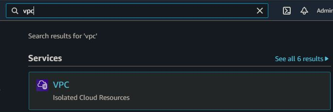
  
  2. Luego de escoger el servicio VPC, vamos a escoger Your VPCs tal y como se muestra en la siguiente imagen.

  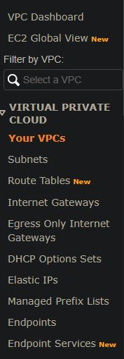
  
  3. Luego vamos a la opción de crear VPC y nos mostrara una pantalla para poder ingresar datos de la VPC nueva
  
  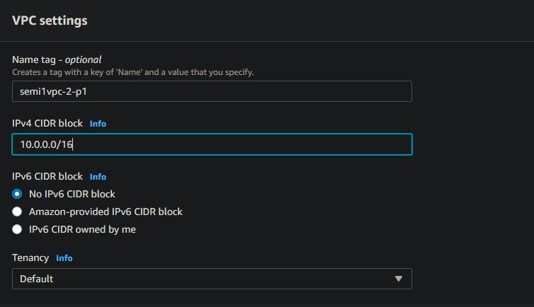
  
  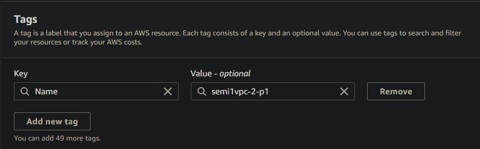
  
  4. Por último presionamos el botón crear VPC, luego de creada podremos ver las distintas VPCs que hemos creado.

  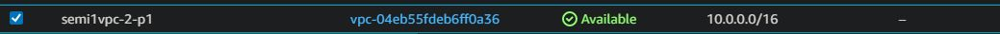
  
  5. Luego de creada nuestra VPC, vamos a crear las subnets necesarias para ello vamos al apartado de Subnets

  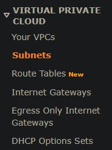
  
  6. Presionamos el botón "Create Subnet"

  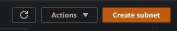
  
  7. Al presionar el botón nos mostrara un formulario para poder ingresar los datos de las Subnets, la cual escribiremos el nombre, tags, IPV4, Availability zone y la VPC que utilizaremos en nuestro caso será la que creamos anteriormente.

  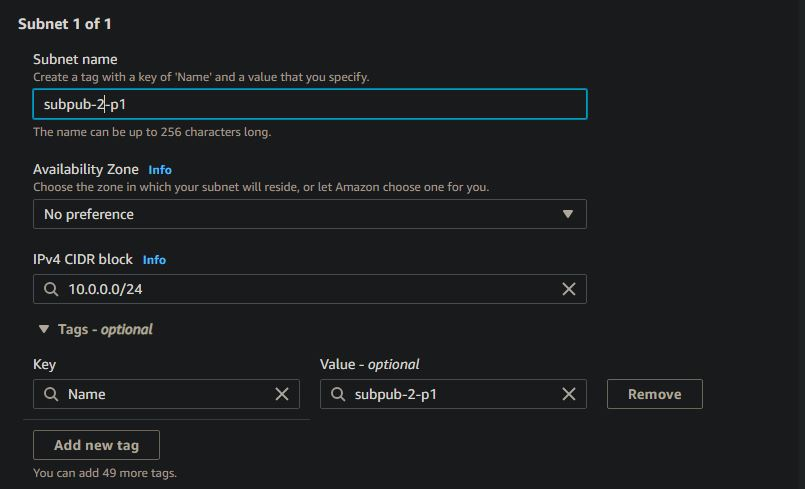
  
  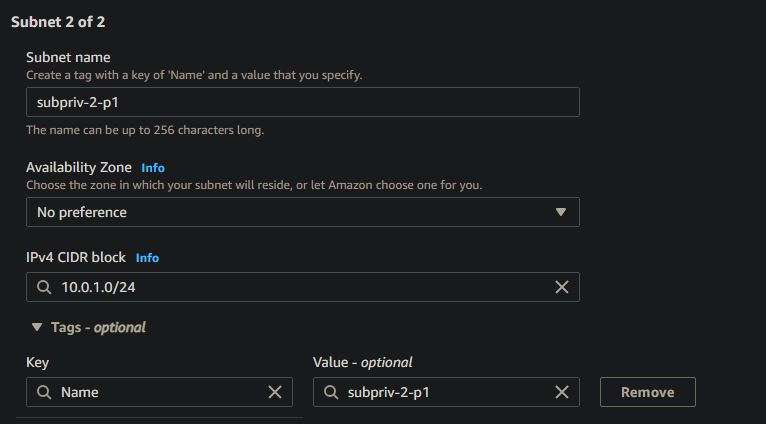
  
  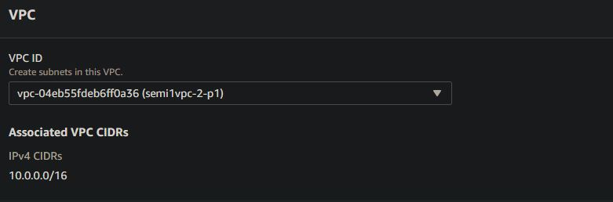
  
  8. Por último podremos visualizar las Subnets que hemos creado.

  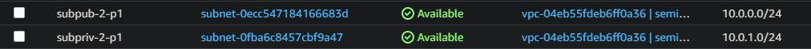
  
  9. Ahora configuraremos un Internet Gateway para poder tener accesibilidad a internet para nuestra subnet publica, para ello vamos a la opción "Internet Gateways".

  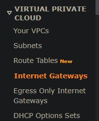
  
  10. Presionamos el botón "Create internet gateway"

  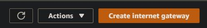
  
  11. Luego de presionar el botón nos desplegara un formulario el cuál es muy sencillo solamente debemos de escribir el nombre y tags de ser necesarios y presionaremos el botón "Create Internet Gateway".

  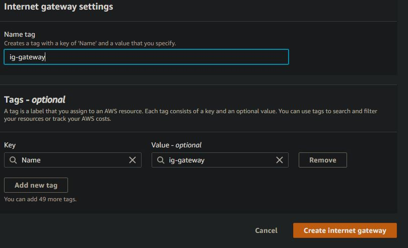
  
  12. Al finalizar el proceso podremos ver los distintos Gateway creados.

  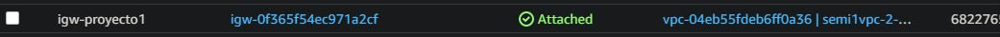
  
  13. También crearemos Tablas de Rutas para poder conectar nuestro Subnet con el gateway a utilizar, para ellos vamos a la opción "Route Tables".

  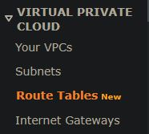
  
  14. Presionamos el botón "Create route table"

  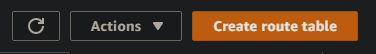
  
  15. Luego nos desplegara un formulario para crear nuestras distintas route tables

  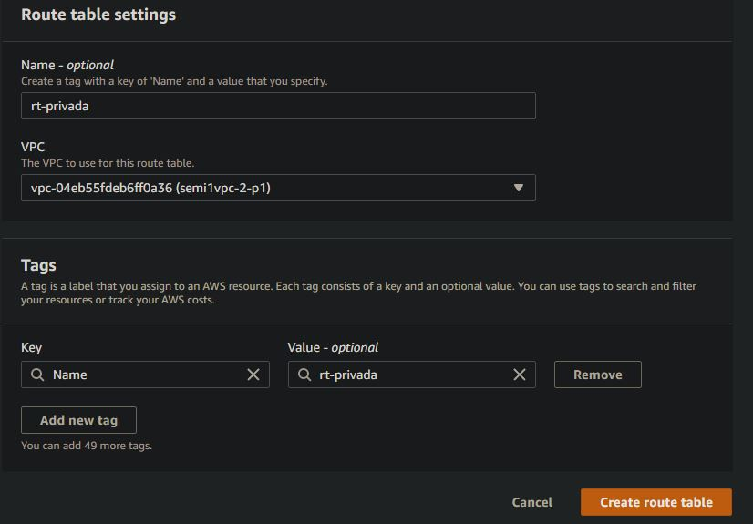
  
  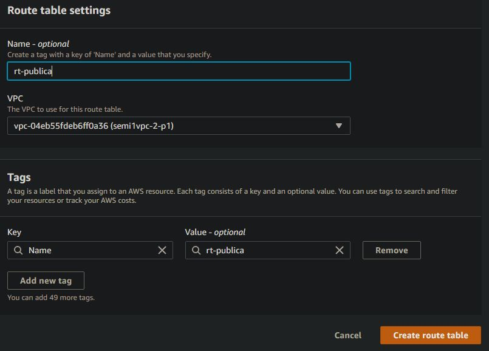
  
  16. Al finalizar el proceso podremos ver los distintos Route Tables creados.

  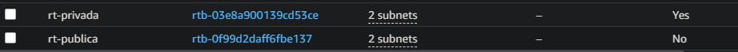
  
  17. Luego escogeremos la Route Table publica para agregar la ruta que nos permitira dejar pasar todo el trafico de datos

  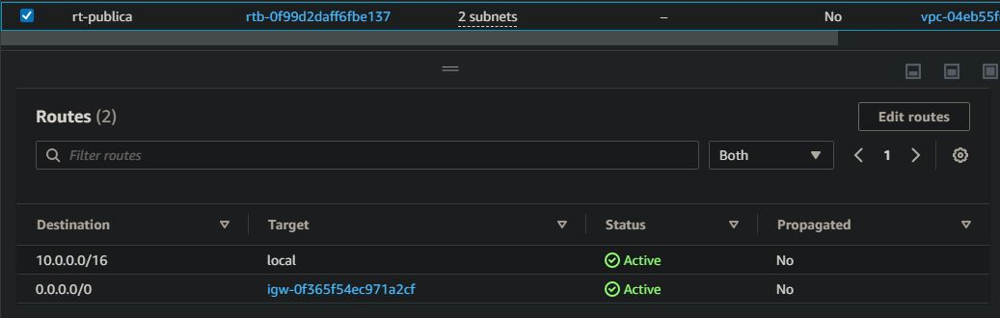
  
  18. Luego de agregar la ruta para dejar ingresar todo el trafico de datos, la asociaciamos a una subnet en este caso será la pública

  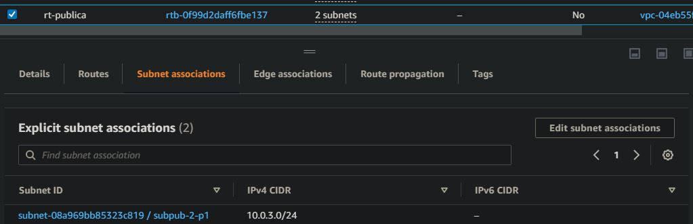
  
  19. De igual forma asociaremos la subnet privada a la route table privada, con la única diferencia que a la route table privada no dejaremos que deje ingresar todo el trafico de datos.

  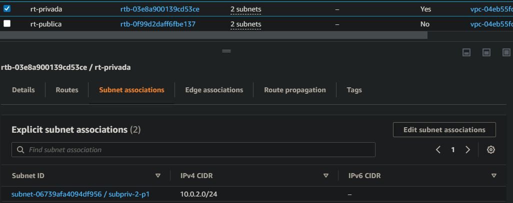
  
  20. Al  finalizar tendremos nuestra VPC creada, dos subnets creadas publica y privada y asociada cada subnet a un route table el cuál deja pasar o no el trafico de datos.
  
 ### Creación de RDS (Base de datos)
  
  1. Vamos a buscar RDS luego escogemos la primero opción que indica.

  
  
  2. Antes de crear una base de datos, se creara una Subnet Groups.
  
  
  
  3. Presionamos el Boton "Create DB Subnet Group"
  
  
  
  4. Luego de presionar el botón mostrara la siguiente pantalla para ingresar los siguientes datos:

  
  
  
  
  5. Por último podremos ver las Subnet creadas.

  
  
  6. Luego de creada la Subnet Group, crearemos la base de datos para ellos nos dirigiremos a "Databases" tal y como se muestra en la siguiente imagen.

  
  
  7. Para crear la base de datos, presionaremos el botón "Create Database"

  
  
  8. Luego de presionar el botón, se mostrara una pantalla para escoger el metodo de creación y el motor de base de datos a utilizar
  
  
  
  9. También escogeremos la prueba gratiuta para crear nuestra base de datos.
  
  
  
  10. Luego podremos escribir el nombre de nuestra base de datos y las credenciales como el nombre y contraseña
  
  
  
  11. En la instancia no modificaremos por lo que lo dejaremos tal y como aparece en la imagen siguiente.
  
  
  
  12. En almacenamiento de igual forma lo dejaremos como esta predeterminado.
  
  
  
  13. En conectividad escogeremos la vpc, esta puede ser una que hayamos creado o ya sea la que este por defecto.

  
  
  
  
  14. Para la autencticación escogeremos por contraseña, y este metodo nos permitira ingresar con la contraseña escrita el pasos anteriores.
  
  
  
  15. Ya para finalizar nos mostrara un pequeño resumen de los costos que podremos tener al crear la base de datos, en nuestro caso al elegir la capa gratuita no tenemos un costo estimado y por último presionaremos el boton "Create Database".

  
  
  16. Al finalizar podremos visualizar nuestras bases de datos creadas.
  
  
  
  ### Creación de Instacias
  
  1. Vamos a buscar EC2 luego escogemos la primero opción que indica.

  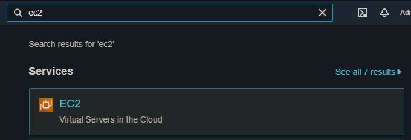
  
  2. Luego de escoger el servicio VPC, vamos a escoger Instances tal y como se muestra en la siguiente imagen.

  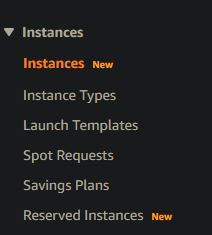
  
  3. Presionamos el Boton "Launch Instances"

  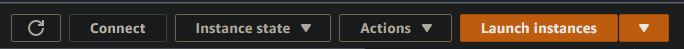
  
  4. Nos mostrara una pantalla para escoger una de las imagenes que nos ofrece AWS

  
  
  5. Luego escogeremos el tipo de instancia, en nuestro caso será la versión gratiuta

  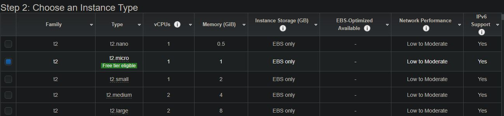
  
  6. Escogeremos a que vpc pertenecera, la subnet en la cuál estara y número de instancias

  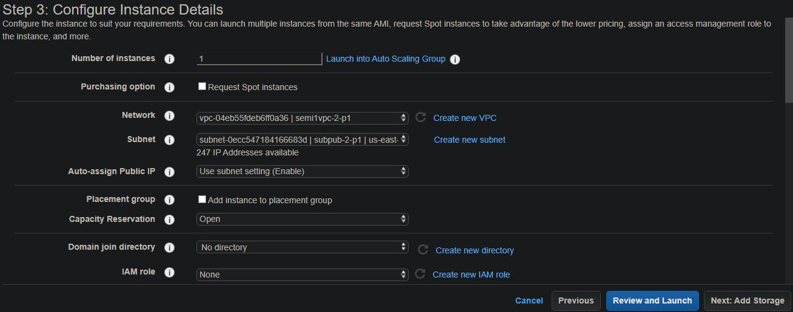
  
  7. Podremos también agregar almacenamiento en nuestro caso no modificaremos ningún dato

  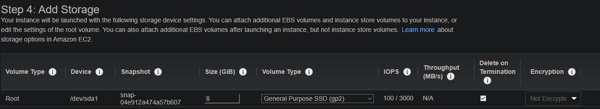
  
  8. Podremos agregar tags de ser necesario

  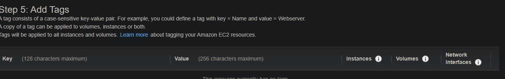
  
  9. Luego escogeremos los security groups que tendremos ya sea que tengamos creados o podemos crear uno nuevo.

  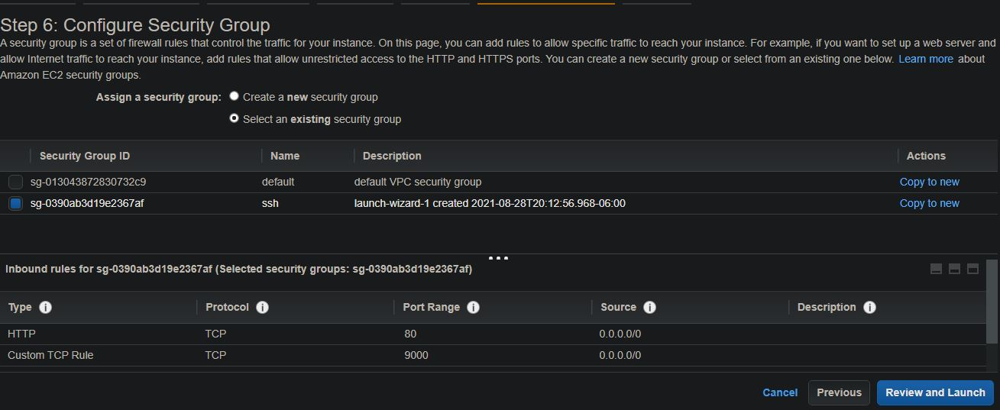
  
  10. Por último tendremos un resumen de lo que hemos configurado en nuestra instancia y si todo estar correcto presionamos el botón "Launch"

  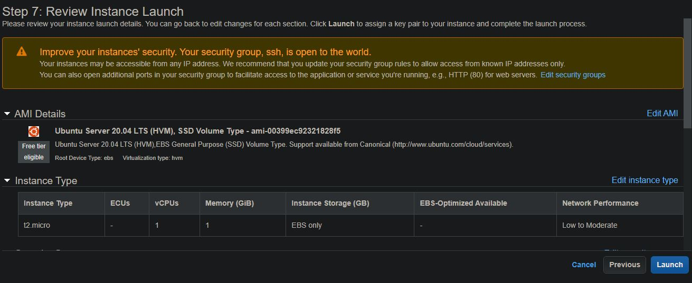
  
  11. Al finalizar el proceso podremos ver las distintas instancias que hemos creado.

  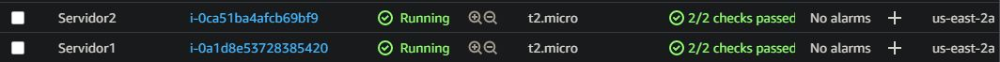
  
  ### Balanceador de Carga
    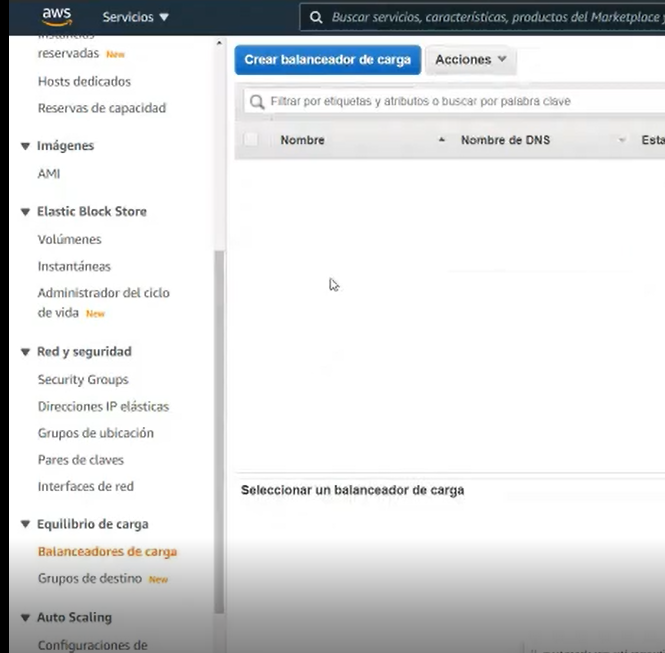

  
  ## Conclusiones
  
  - Se aplicaron los conocimientos que se adquirieron tanto en laboratorio como el clase.
  - Se integraron e implementaron servicios de AWS para la creación de una aplicación web.
  - Se aplicaron técnologias y servicios de AWS en entorno real.
