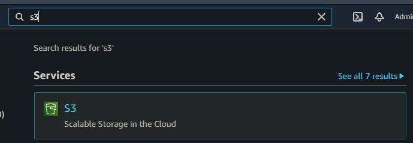

# Manual técnico

# U-Storage 

## Indice

  - [Objetivos](#objetivos)
  - [Arquitectura](#arquitectura)
  - [Usuarios IAM](#usuarios-iam)
  - [Pasos](#pasos)
  - [Conclusion](#conclusion)

## Objetivos
### General
- Cloud permite la innovación a través del acceso a nuevas tecnologías de forma
rápida, segura y fácil.

### Específicos
- Aplicar los conocimientos adquiridos tanto de la clase magistral y el laboratorio.
- Implementar una arquitectura utilizando servicios en la nube.
- Integrar servicios de AWS.
- Aplicar las tecnologías de la nube a un entorno real.

## Arquitectura

## Usuario IAM
  
  ### Usuarios Administrador
  Administrador_201403632
  Administrador_201603052
  
  ### Usuario para bucket
  s3_user
 
 ## Pasos
  ### Creación de bucket
  Para la creación de un Bucket primero se debe de buscar S3
  
   
 
  luego ir a boton "Crear Bucket" al presionar este boton saldran los siguientes datos que se deben de llenar:
  
  1. Primero se debe de ingresar el nombre de Bucket y región en la cuál se desea crear.
 
   
 
 2. Luego se ingresa si deseamos tener nuestro bucket privado o público, para nuestro caso será publico por lo que desmarcaremos "Block all public access"
 
  
 
 3. Al ingresar los datos anteriores veremos una opción la cuál nos permite tener versionamientos de bucket, para nuestro caso la dejaremos "Disabled", también podremos      agregar Tags.
 
  
  
  4. Encriptacion la dejaremos por defecto, para finalizar presionamos el botón "Crear Bucket"
  
  

  5. Al final podremos ver el Bucket creado.

  
 
 ### Creación de RDS (Base de datos)
 
  
  
  
  ### Creación de VPC
  
