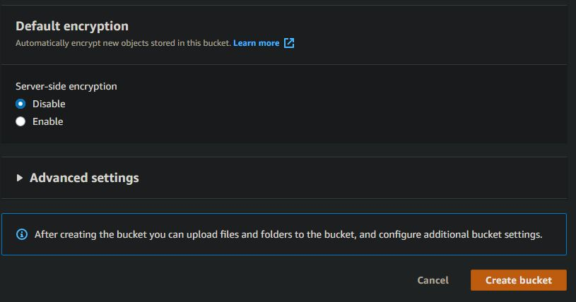

# Manual técnico

# U-Storage 

## Indice

  - [Objetivos](#objetivos)
  - [Arquitectura](#arquitectura)
  - [Usuarios IAM](#usuarios-iam)
  - [Pasos](#pasos)
  - [Conclusion](#conclusion)

## Objetivos
### General
- Cloud permite la innovación a través del acceso a nuevas tecnologías de forma
rápida, segura y fácil.

### Específicos
- Aplicar los conocimientos adquiridos tanto de la clase magistral y el laboratorio.
- Implementar una arquitectura utilizando servicios en la nube.
- Integrar servicios de AWS.
- Aplicar las tecnologías de la nube a un entorno real.

## Arquitectura

## Usuario IAM
  
  ### Usuarios Administrador
  Administrador_201403632
  Administrador_201603052
  
  ### Usuario para bucket
  s3_user
 
 ## Pasos
  ### Creación de bucket
  Para la creación de un Bucket primero se debe de buscar S3
  
   
 
  luego ir a boton "Crear Bucket" al presionar este boton saldran los siguientes datos que se deben de llenar:
  
  1. Primero se debe de ingresar el nombre de Bucket y región en la cuál se desea crear.
 
   
 
 2. Luego se ingresa si deseamos tener nuestro bucket privado o público, para nuestro caso será publico por lo que desmarcaremos "Block all public access"
 
  
 
 3. Al ingresar los datos anteriores veremos una opción la cuál nos permite tener versionamientos de bucket, para nuestro caso la dejaremos "Disabled", también podremos      agregar Tags.
 
  
  
  4. Encriptacion la dejaremos por defecto, para finalizar presionamos el botón "Crear Bucket"
  
  

  5. Al final podremos ver el Bucket creado.

  
 
 ### Creación de RDS (Base de datos)
  
  1. Vamos a buscar RDS luego escogemos la primero opción que indica.

  
  
  2. Antes de crear una base de datos, se creara una Subnet Groups.
  
  
  
  3. Presionamos el Boton "Create DB Subnet Group"
  
  
  
  4. Luego de presionar el botón mostrara la siguiente pantalla para ingresar los siguientes datos:

  
  
  
  
  5. Por último podremos ver las Subnet creadas.

  
  
  6. Luego de creada la Subnet Group, crearemos la base de datos para ellos nos dirigiremos a "Databases" tal y como se muestra en la siguiente imagen.

  
  
  7. Para crear la base de datos, presionaremos el botón "Create Database"

  
  
  8. Luego de presionar el botón, se mostrara una pantalla para escoger el metodo de creación y el motor de base de datos a utilizar
  
  
  
  9. También escogeremos la prueba gratiuta para crear nuestra base de datos.
  
  
  
  10. Luego podremos escribir el nombre de nuestra base de datos y las credenciales como el nombre y contraseña
  
  
  
  11. En la instancia no modificaremos por lo que lo dejaremos tal y como aparece en la imagen siguiente.
  
  
  
  12. En almacenamiento de igual forma lo dejaremos como esta predeterminado.
  
  
  
  13. En conectividad escogeremos la vpc, esta puede ser una que hayamos creado o ya sea la que este por defecto.

  
  
  
  
  14. Para la autencticación escogeremos por contraseña, y este metodo nos permitira ingresar con la contraseña escrita el pasos anteriores.
  
  
  
  15. Ya para finalizar nos mostrara un pequeño resumen de los costos que podremos tener al crear la base de datos, en nuestro caso al elegir la capa gratuita no tenemos un costo estimado y por último presionaremos el boton "Create Database".

  
  
  16. Al finalizar podremos visualizar nuestras bases de datos creadas.
  
  
  
  ### Creación de VPC
  
  
