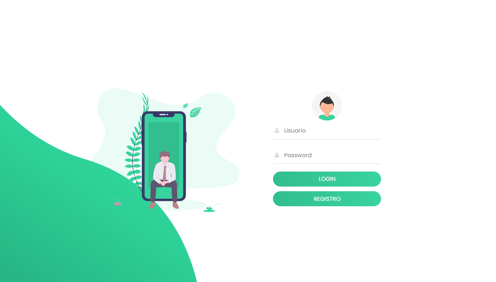
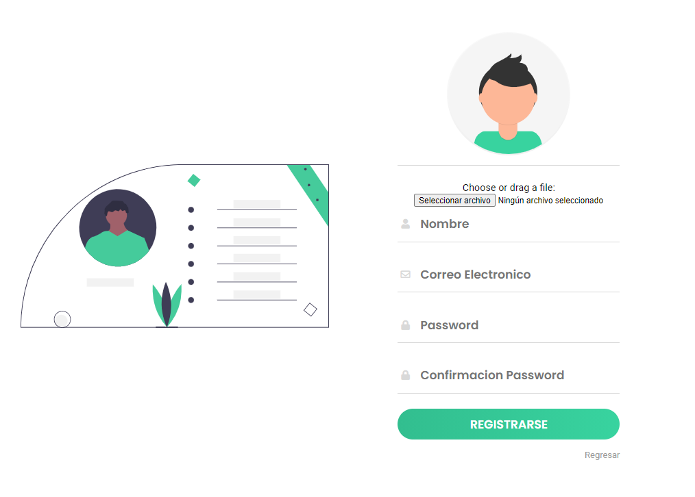
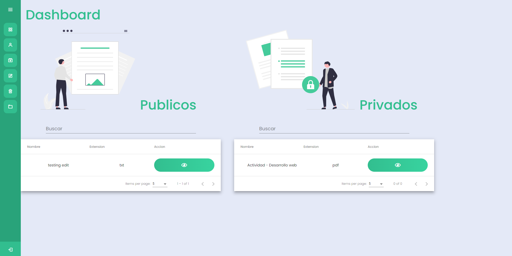
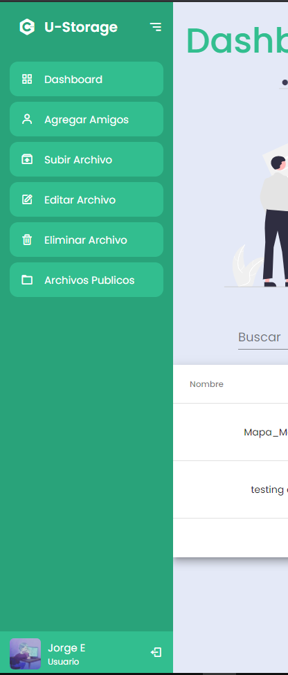
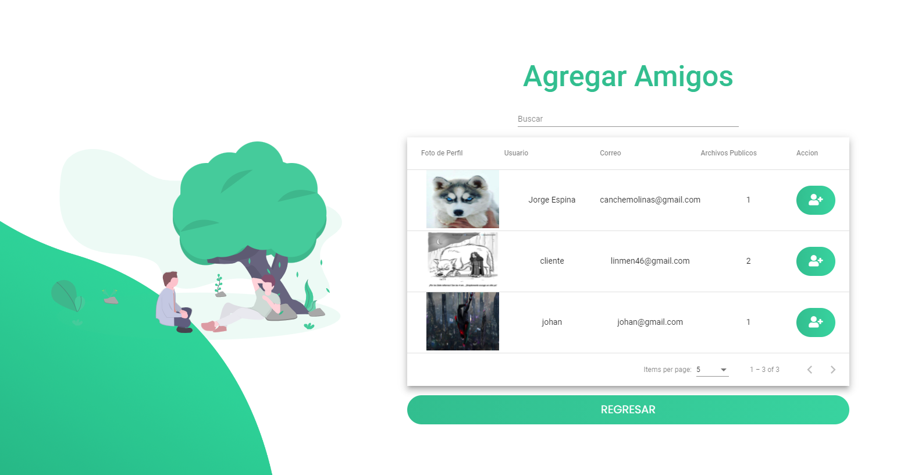
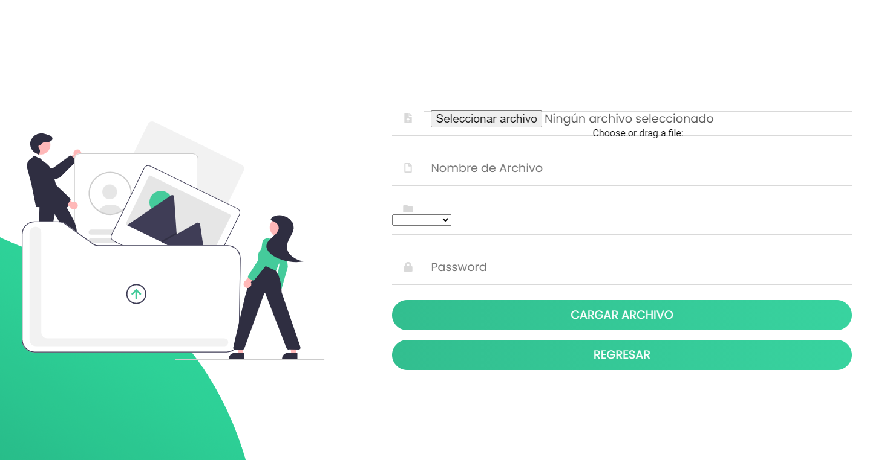
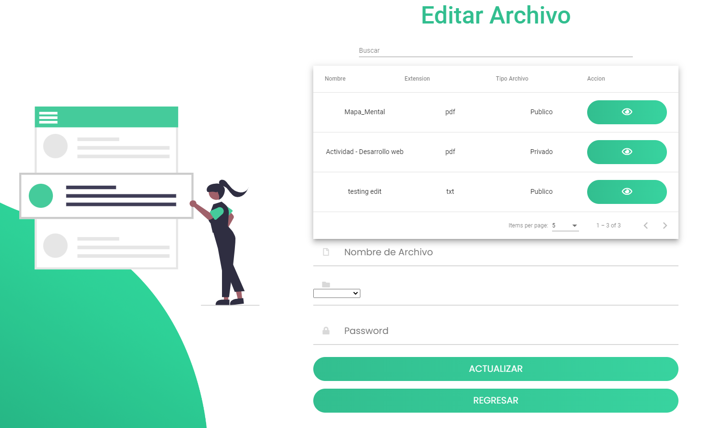
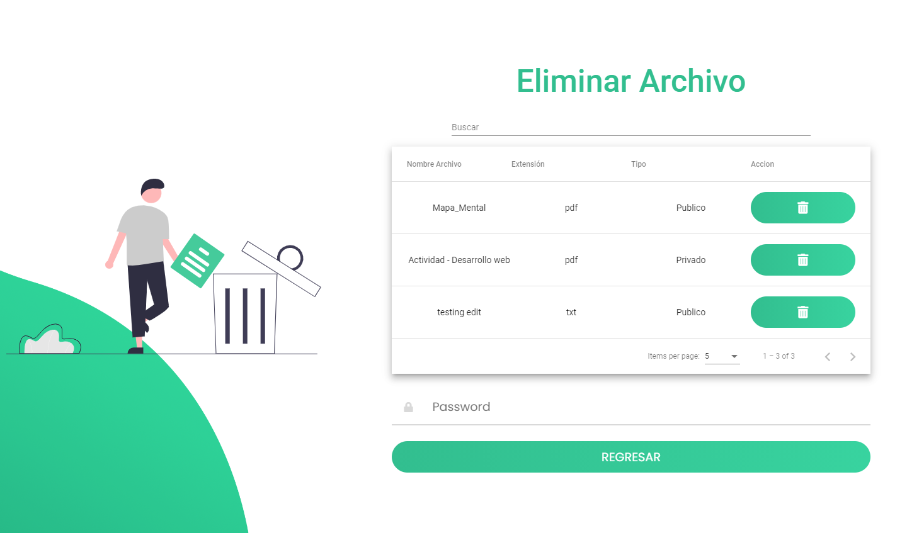
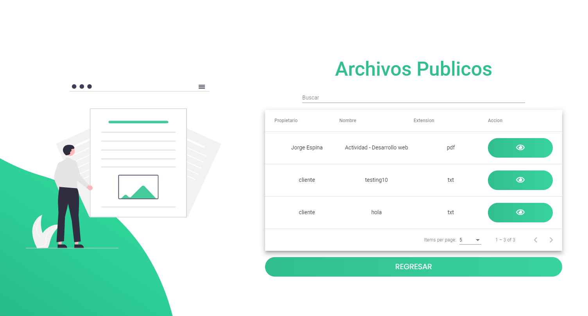

# Manual Usuario

# U-Storage 

## Integrantes

|            Nombre             |   Carné   |      
| :---------------------------: | :-------: | 
|   Jorge David Espina Molina   | 201403632 |   
|   Johan Leonel Chan Toledo    | 201603052 |  

## Indice

  - [Objetivos](#objetivos)
  - Aplicacion
    - [Login](#login)
    - [Registro](#registro)
    - [Dashboard Principal](#dashboard-principal)
    - [Subir Archivo](#subir-archivos)
    - [Eliminar Archivo](#eliminar-archivos)
    - [Modificar Archivo](#modificar-archivos)
    - [Visualizar Archivos](#visualizar-archivos)
    - [Agregar Amigos](#agregar-amigos)

## Objetivos
### General
- Cloud permite la innovación a través del acceso a nuevas tecnologías de forma
rápida, segura y fácil.

### Específicos
- Aplicar los conocimientos adquiridos tanto de la clase magistral y el laboratorio.
- Implementar una arquitectura utilizando servicios en la nube.
- Integrar servicios de AWS.
- Aplicar las tecnologías de la nube a un entorno real.
  
## Login
- Usuario: correo electronico en el cual se creo el usuario en registro.
- Password: Ingreso de contraseña de la cuenta.
  

## Registro
- Selecionar la imagen: para la foto de perfil.
- Nombre: Del usuario para crear la cuenta.
- Correo Electronico: para el usuario que se creara.
- Password: clave para poder ingresar a la cuenta.
  

## Dashboard
- Para la navegacion de la pagina web y vista de los archivos publicos y privados.

## Barra Navegacion
- Barra de navegacion entre las vistas de la web y una vista para el perfil del usuario que esta logueado.
  

## Agregar Amigos
- Se desplega todos los los usuarios para agregar con paginacion, con un boton en la columna accion se puede ir agregando a amigos.
  

## Subar Archivo
- Subir un archivo se selecciona el documento a subir el cual puede ser png,jpg,txt, pdf.
- se puede poner el archivo en:
  - Publico.
  - Privado.
- Password de confirmacion para realizar el upload del archivo.
  

## Editar Archivo
Se desplegara todos los archivos que tenga el usuario logueado con paginacion,
tendra una tabla con nombre accion el cual hay un boton el cual puede seleccionarlo cuando desee editar la informacion del archivo el cual solo puede ser el nombre y el tipo de archivo:
- Publico.
- Privado.
Password es para confirmar la contraseña y asi poder editar el archivo.

## Eliminar Archivo
Se desplegara todos los archivos que tenga el usuario logueado con paginacion,
tendra una tabla con nombre accion hay un boton en el cual puede seleccionarlo cuando desee eliminar pero antes de poder darle eliminar tiene que ingresar password en al cuadro de texto abajo para poder eliminar el archivo.

## Archivo Publicos
Desplegara todos los archivos publicos de sus amigos agregados.

